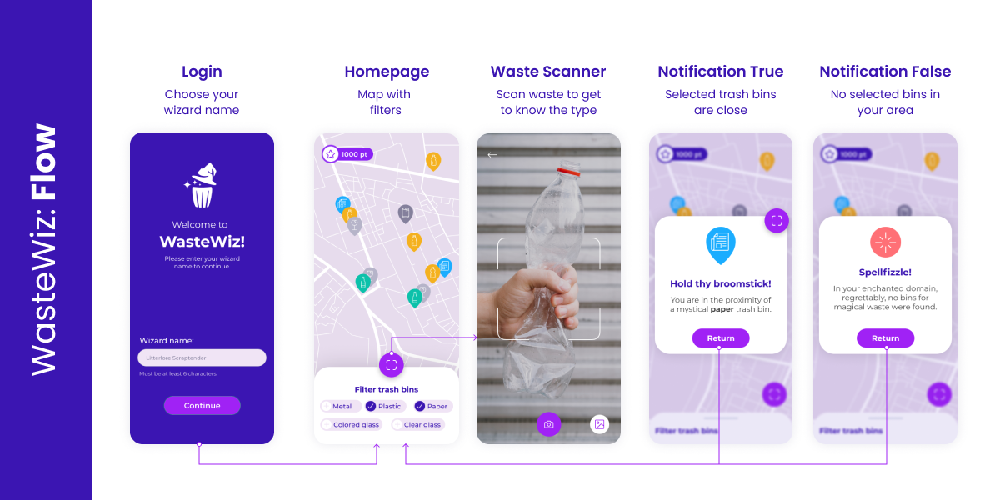

# WasteWiz: You shall not waste!

 
 

  

# Description

  Introducing WasteWiz, your ultimate companion for recycling and seeking the closest trash bin!
   
   
    WasteWiz is a comprehensive mobile app designed to enhance your recycling experience. With AI-powered <b>object detection</b> model support and automated trash bin finder, WasteWiz empowers the regular users to separate the waste on-the-go.
   
   
  
 ## Features
  
- **Nearby Disposal Options:** WasteWiz not only identifies the type of waste but also provides users with information on nearby disposal options.
- **Scan & Identify:** WasteWiz utilizes advanced image recognition to instantly identify the material composition of various waste items.
- **Classification:** Once scanned, the app accurately categorizes the waste into specific types such as paper, plastic, bio waste, glass, and more.
- **Gamification:** Gain points when making informed decisions about recycling and proper disposal. Points can be used to purchase in various ways in cooperation with our external partners and stakeholders.
   
   
  ## Benefits

- **Environmental Consciousness:** Contribute to a sustainable environment by correctly disposing of waste materials.
- **Convenience:** Easily find nearby waste disposal facilities or recycling centers.
- **Education:** Learn about the various waste categories and their impact on the environment.    

## Future Enhancements

- Integration of a community-driven database for disposal locations.
- Real-time updates on recycling initiatives and environmental news.
- More gamification elements to encourage and reward sustainable waste disposal practices.

# Technologies

# Mockup
</td>

# About us
</td>
